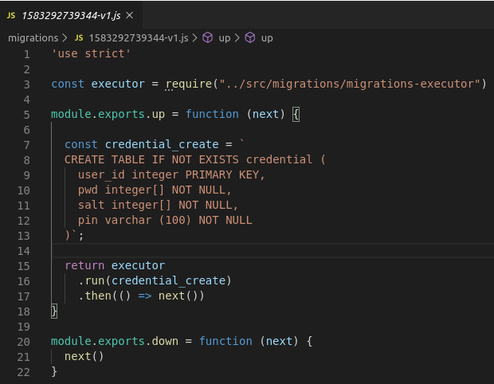

# Transactional PIN Service
Service that exposes functionality to save and retrieve password and Personal Identification Number (PIN) for given user.

## Mission: Retrieve transactional PIN

<p align="justify">
Our users are assigned a debit card after they complete their onboarding. During this process, the user chooses a PIN that will be assigned to their card before it’s delivered.However, users tend to forget this PIN, so your mission is to give them the ability to retrieve their transactional PIN at any time from their app. However, we don’t want to store it in plain text. Similarly to how only a user knows their password, no one should be able to figure out what a user’s PIN is, regardless of their level of access.

Your task is to create a service, that covers these use cases:

* <p align="justify"> During the user’s onboarding, we should assign the PIN to the card and store their password and PIN (both entered by the user in our mobile app).
* <p align="justify"> They should be able to retrieve their unencrypted PIN at any moment, given they enter their password.

* <p align="justify"> The user should be able to change their password without losing access to their PIN.

<p align="justify">
Don’t worry about assigning the PIN to the card, you can assume that you’ll call an external service (that expects the PIN in plain text) for that and stub it out.
The main thing to keep in mind is that passwords or PINs should never be stored in plain text and only someone that knows the user’s password (hopefully only the user) should be able to retrieve the PIN.

***
### Installation

* Open a terminal
* You must have installed the latest version of [Node.js](https://nodejs.org/en/).

```sh
# installation steps
$ sudo apt update
$ sudo apt install nodejs
$ sudo apt install npm

# check version
$ node -v
v12.14.1

# check version
$ npm -v
6.13.4
```

* You must have installed [Typescript](https://www.typescriptlang.org/).

```sh
# Installation steps
$ sudo npm i -g typescript

# check version
$ tsc -v
Version 3.7.
```

* You must have installed [Migrate](https://www.npmjs.com/package/migrate).

```sh
# Installation steps
$ sudo npm i -g migrate

# check version
$ migrate --version
1.6.2
```

* You must have installed [Mocha](https://mochajs.org/).

```sh
# Installation steps
$ sudo npm i -g mocha

# check version
$ mocha --version
7.1.0
```

* You must have installed [Docker](https://www.docker.com/).

```sh
# check version
$ docker -v
Docker version 18.09.7, build 2d0083d
```

* You must have installed [docker-compose](https://www.docker.com/).

```sh
# check version
$ docker-compose -v
docker-compose version 1.21.2, build a133471
```
```sh
#Clone repository
$ git clone git@github.com:yexhoo/transactional-pin-service.git
```
```sh
# Install the dependencies.
$ cd transactional-pin-service
$ npm install
```


```sh
# Build project
$ npm run build

# Output
> transactional-pin-service@1.0.0 build /home/yexhoo/Documents/git/transactional-pin-service
> rm -rf dist/ && tsc -p .
```
```sh
# Run tests
$ npm run test

# Output
> transactional-pin-service@1.0.0 test /home/yexhoo/Documents/git/transactional-pin-service
> mocha -r ts-node/register test/**/*.spec.ts

  Aes
    ✓ encrypt data
  KeyDerivation
    ✓ encrypt data (94ms)
  GeneratorService
    ✓ Get salt method returns different values every time
  UserValidator
    ✓ User id is required
    ✓ Password is required
    ✓ PIN is required
    ✓ Validation ok
  7 passing (131ms)
```

### Configurations.
***
Create .env file at root of project ```/transactional-pin-service/.env``` with next information:

```
ITERATION_COUNT=500
DERIVED_KEY_LEN=8
HASH=MD5
PORT=3000
DB_USER=user
DB_PASSWORD=secret
DB_SCHEMA=challenge
```

This project uses **Key Derivation Function (KDF)** for passwords cipher. We use [js-crypto-pbkdf](https://www.npmjs.com/package/js-crypto-pbkdf) node module that implements KDF.

Description:

* **ITERATION_COUNT:** Number of iterations of KDF algorithm (unsigned integer).
* **DERIVED_KEY_LEN:** Length of derived key(unsigned integer).
* **ITERATION_COUNT:** Type of hash algorithm it could be SHA-384, SHA-512, SHA, MD5,SHA3-512, SHA3-384, SHA3-256, SHA3-224 (string).
* **PORT:** Port that applications going to use (3000)
* **DB_USER:** User for Data Base connection.
* **DB_PASSWORD:** Password for Data Base connection.
* **DB_SCHEMA:** Name of Data Base that applications it's going to use.

This file is going to be automatically copied to docker container. This values ​​will be placed as environment variables.

***
### Run in localhost.

Once the file has been created you can run the application in localhost environment.

```sh
# Build project
$ docker-compose up

# Output
Starting transactional-pin-service_postgres_1 ... done
Starting transactional-pin-service_app_1      ... done
Attaching to transactional-pin-service_postgres_1, transactional-pin-service_app_1
postgres_1  | 
postgres_1  | PostgreSQL Database directory appears to contain a database; Skipping initialization
postgres_1  | 
postgres_1  | 2020-03-05 00:54:27.159 UTC [1] LOG:  starting PostgreSQL 12.1 (Debian 12.1-1.pgdg100+1) on x86_64-pc-linux-gnu, compiled by gcc (Debian 8.3.0-6) 8.3.0, 64-bit
postgres_1  | 2020-03-05 00:54:27.160 UTC [1] LOG:  listening on IPv4 address "0.0.0.0", port 5432
postgres_1  | 2020-03-05 00:54:27.160 UTC [1] LOG:  listening on IPv6 address "::", port 5432
postgres_1  | 2020-03-05 00:54:27.400 UTC [1] LOG:  listening on Unix socket "/var/run/postgresql/.s.PGSQL.5432"
postgres_1  | 2020-03-05 00:54:27.759 UTC [24] LOG:  database system was interrupted; last known up at 2020-03-05 00:54:04 UTC
postgres_1  | 2020-03-05 00:54:29.350 UTC [24] LOG:  database system was not properly shut down; automatic recovery in progress
postgres_1  | 2020-03-05 00:54:29.393 UTC [24] LOG:  invalid record length at 0/166C028: wanted 24, got 0
postgres_1  | 2020-03-05 00:54:29.393 UTC [24] LOG:  redo is not required
app_1       | 
app_1       | > transactional-pin-service@1.0.0 dev /app
app_1       | > nodemon src/app.ts 
app_1       | 
postgres_1  | 2020-03-05 00:54:29.707 UTC [1] LOG:  database system is ready to accept connections
app_1       | [nodemon] 2.0.2
app_1       | [nodemon] to restart at any time, enter `rs`
app_1       | [nodemon] watching dir(s): *.*
app_1       | [nodemon] watching extensions: ts,json
app_1       | [nodemon] starting `ts-node src/app.ts`
app_1       | Transactional PIN service is running ...
```

* When you see the message **"Transactional PIN service is running ..."** the applications is running on port defined in .env file and Postgres Data Base running on 5432 port.

```sh
# Health Check
# Open internet browser and type:
http://localhost:3000/healthCheck

# Output
{"application":"transactionl-pin-service"}
```

```sh
# Run migrations
# Open internet browser and type:
http://localhost:3000/migration/up

# Output
# You can get something like this
{"lastRun":"1583292739344-v1.js","migrations":[{"title":"1583292739344-v1.js","timestamp":1583351368332}]}
```
* Migration process take files at migrations folder and execute them on Data Base.

<p align="center"><p align="center"></p>
<br>
<p align="center"><p align="center"></p>

* After that you can check Postgres local Data Base at port 5432. Data base name connection params are defined at .env file. There must be two tables created ```migrate``` and ```credential```
<p align="center"><p align="center"></p>
<br>
<p align="center"><p align="center"></p>


## **Endpoints**

***
**Save credentials**

* **Description:** Allows to store password and pin for given user.
* **URL:** http://localhost:3000/credentials

* **Method:** `POST`
  
*  **Body:** `{"id": 1,"password": "text","pin": "ABCD"}`

   **Required:** `id=[integer], password=[string], pin=[string]`
   

* **Success Response:**

  * **Code:** 200 <br />
    **Content:** `{"id": 1,"password": "text","pin": "ABCD"}`
    
* **Error Response:**

  * **Code:** 400 Bad Request <br />
    **Content:** `{"error": "User data is required"}`
  * **Code:** 400 Bad Request <br />
    **Content:** `{"error": "User id is required"}`
  * **Code:** 400 Bad Request <br />
    **Content:** `{"error": "Password is required"}`
  * **Code:** 400 Bad Request <br />
    **Content:** `{"error": "PIN is required"}`  
  * **Code:** 400 Bad Request <br />
    **Content:** `{"error": "User credentials already exists"}`  

* **Sample Call:**

  `{"id": 111,"password": "password","pin": "1234"}`

***
**Update password**


* **Description:** Allows to update password for given user and password.

* **URL:** http://localhost:3000/credentials

* **Method:** `PUT`
  
*  **Body:** `{"id": 1,"password": "text","newPassword": "otherText"}`

   **Required:** `id=[integer], password=[string], newPassword=[string]`
   

* **Success Response:**

  * **Code:** 200 <br />
    **Content:** `{"id": 111,"password": "password", newPassword:"otherText", "pin": ""}`
    
* **Error Response:**

  * **Code:** 400 Bad Request <br />
    **Content:** `{"error": "User data is required"}`
  * **Code:** 400 Bad Request <br />
    **Content:** `{"error": "User id is required"}`
  * **Code:** 400 Bad Request <br />
    **Content:** `{"error": "Password is required"}`
  * **Code:** 400 Bad Request <br />
    **Content:** `{"error": "New password is required"}`  
  * **Code:** 400 Bad Request <br />
    **Content:** `{"error": "User not exists"}`  
  * **Code:** 400 Bad Request <br />
    **Content:** `{"error": "Wrong password"}`    

* **Sample Call:**

  `{"id": 111,"password": "1234","newPassword": "5678"}`  


***
**Retrieve PIN**

* **Description:** Allows to get PIN for given user and password.

* **URL:** http://localhost:3000/pin/:userId/:password

* **Method:** `GET`
  
*  **Url params:** `userId, password`

   **Required:** `userId=[integer], password=[string]`

* **Success Response:**

  * **Code:** 200 <br />
    **Content:** `{"id": 111,"password": "password", newPassword:"", "pin":"ABCD"}`
    
* **Error Response:**

  * **Code:** 400 Bad Request <br />
    **Content:** `{"error": "User data is required"}`
  * **Code:** 400 Bad Request <br />
    **Content:** `{"error": "User id is required"}`
  * **Code:** 400 Bad Request <br />
    **Content:** `{"error": "Password is required"}`
  * **Code:** 400 Bad Request <br />
    **Content:** `{"error": "User not exists"}`  
  * **Code:** 400 Bad Request <br />
    **Content:** `{"error": "Wrong password"}`    

* **Sample Call:**

  `http://localhost:3000/pin/1/myPassword`    

***
**Healt Check**

* **Description:** Allows to validate if application is running.

* **URL:** http://localhost:3000/healthCheck

* **Method:** `GET`
  
*  **Url params:** `none`

   **Required:** `none`

* **Success Response:**

  * **Code:** 200 <br />
    **Content:** `{
    "application": "transactionl-pin-service"
}`
    
* **Error Response:**

  * **Code:** 404 Not Found <br />
    **Content:** ``

* **Sample Call:**

  `http://localhost:3000/healthCheck`    

***
**Migrations**

* **Description:** Allows to run migrations over Data Base.

* **URL:** http://localhost:3000/migration/up

* **Method:** `GET`
  
*  **Url params:** `none`

   **Required:** `none`

* **Success Response:**

  * **Code:** 200 <br />
    **Content:** `{"lastRun":"1583292739344-v1.js","migrations":[{"title":"1583292739344-v1.js","timestamp":1583351368332}]}`
    
* **Error Response:**

  * **Code:** 500 Internal Server Error <br />
    **Content:** ``

* **Sample Call:**

  `http://localhost:3000/migration/up`    